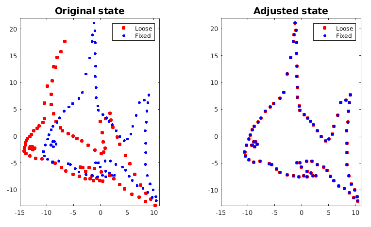
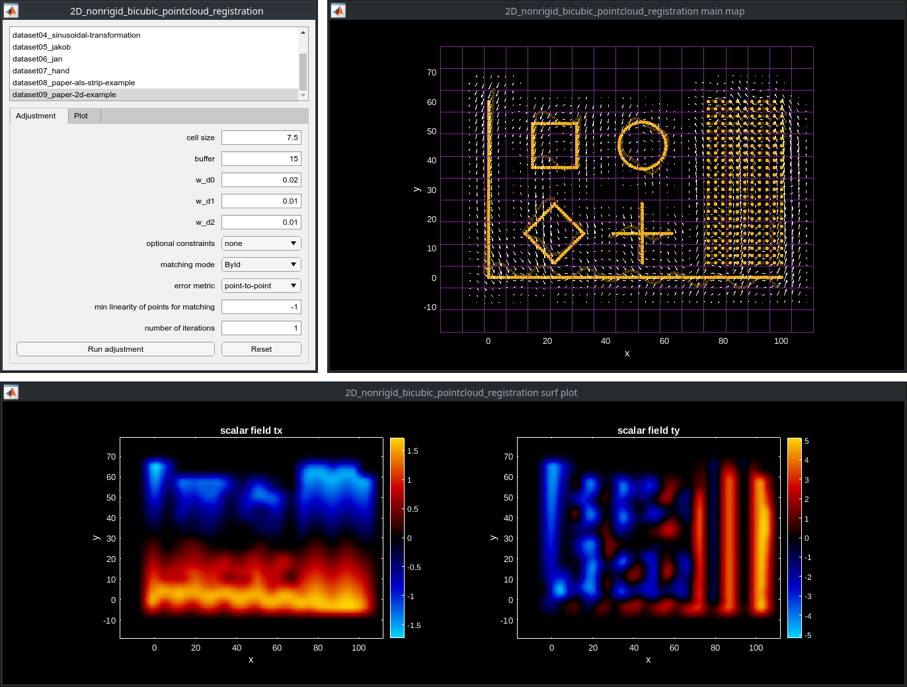

# 2D Non-Rigid Tricubic Point Cloud Registration

## Introduction

This repository contains a prototype implementation of a 2D non-rigid point cloud registration algorithm. The algorithm is described in the paper "**Non-rigid point cloud registration using piece-wise tricubic polynomials as transformation model**".

The paper can be found [here](https://www.mdpi.com/2072-4292/15/22/5348) - it can be cited as:

```
@article{glira2023a,
  article-number = {5348},
  author         = {Glira, Philipp and Weidinger, Christoph and Otepka-Schremmer, Johannes and Ressl, Camillo and Pfeifer, Norbert and Haberler-Weber, Michaela},
  doi            = {10.3390/rs15225348},
  issn           = {2072-4292},
  journal        = {Remote Sensing},
  number         = {22},
  title          = {Nonrigid Point Cloud Registration Using Piecewise Tricubic Polynomials as Transformation Model},
  url            = {https://www.mdpi.com/2072-4292/15/22/5348},
  volume         = {15},
  year           = {2023}
}
```

Also available on [](https://de.mathworks.com/matlabcentral/fileexchange/136784-2d_nonrigid_tricubic_pointcloud_registration).

An efficient 3D implementation of this algorithm written in C++ can be found [here](https://github.com/AIT-Assistive-Autonomous-Systems/3D_nonrigid_tricubic_pointcloud_registration).

## Minimal example

A [minimal example](test/minimal_example.m) is provided in the [test](test) folder. It can be started with:

```matlab
cd test
minimal_example
```
This example registers two point clouds of a fish in a non-rigid manner. The result is:



Source of the point clouds: *Myronenko, A.; Song, X.; Carreira-Perpinan, M. Non-rigid point set registration: Coherent point drift. Advances in neural
information processing systems 2006, 19.*

## GUI

We have implemented a graphical user interface (GUI) for testing the algorithm - it can be started in the [test](test) folder with:

```matlab
cd test
run_nonrigidRegistrationGUI.m
```



## Requirements

The prototype has been tested with *Matlab R2023a*. It requires the "Statistics and Machine Learning Toolbox".

## Star History

[](https://www.star-history.com/#AIT-Assistive-Autonomous-Systems/2D_nonrigid_tricubic_pointcloud_registration&Date)